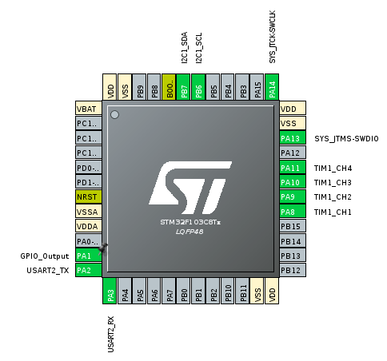
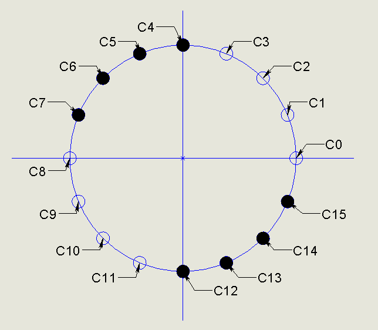
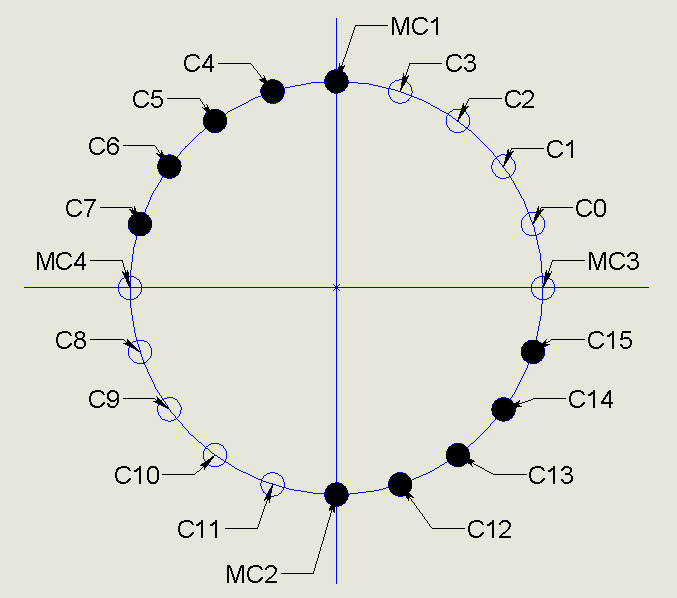

# README
ШИМ контроллер на 20 каналов с интерфейсом ModbusRTU.
16 основных каналов при помощи микросхемы pca9685, и 4 дополнительных канала средствами STM32.

## Tools
* Rust nightly
* Rtic
* free-modbus
* pwm-pca9685

## Build
```
$ git clone --recurcive https://github.com/ololoshka2871/pwm-20ch
$ cd pwm-20ch
$ rustup override set nightly
$ cargo build
```

# [cargo make](https://sagiegurari.github.io/cargo-make/)
1. flash - use openocd

# Connection


### pca9685's 16 channels 
* CH 1-8 - "прямые"
* CH 9-16 - "инверсные"

### MCU's channels
* CH1 (PA7) - "инверсный"
* CH2 (PA8) - "инверсный"
* CH3 (PA10) - "прямой"
* CH4 (PA11) - "прямой"

## Подключение к "снаряду"

### 16 канальный режим


### 20 канальный режим

